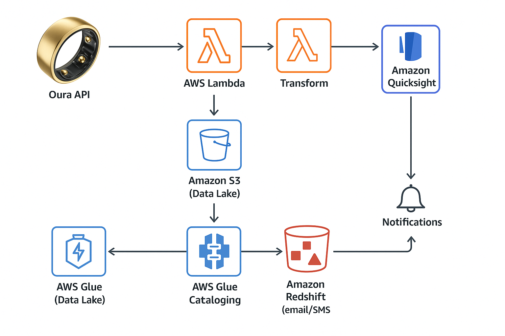

# Oura Ring – Personal Analytics Platform on AWS

This solution provides daily email/sms personalised notifications based on your own sleep data.

## What it does

- Automatically pulls your daily data (sleep, readiness) from the Oura API
- Stores raw JSON files in Amazon S3
- Transforms data to Parquet using AWS Glue
- Loads data into Redshift for advanced querying
- Sends personalized health notifications via Amazon SNS (e.g., low HRV alerts)

## Architecture Overview

## Tech Stack

- **Oura Cloud API v2**
- **AWS Lambda** – data ingestion
- **Amazon S3** – data lake storage
- **AWS Glue** – ETL jobs and data cataloging
- **Amazon Redshift** – querying and analytics
- **Amazon SNS** – email(/sms) alerts
