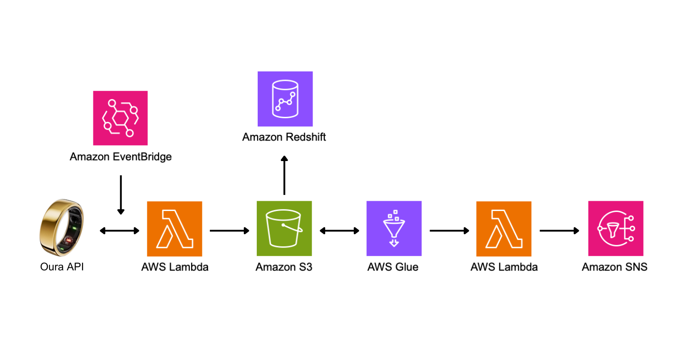

# Oura Ring – Personal Analytics Platform on AWS

This project builds a personal data pipeline that collects, stores, transforms, analyzes, and visualizes daily health data from the [Oura Ring](https://ouraring.com) using the AWS cloud.

## 🚀 What it does

- Automatically pulls your daily data (sleep, readiness, activity) from the Oura API
- Stores raw JSON files in Amazon S3
- Transforms data to Parquet using AWS Glue
- Loads data into Redshift for advanced querying
- Displays health trends via Amazon QuickSight dashboards
- Sends personalized health notifications via Amazon SNS (e.g., low HRV alerts)

## Architecture Overview

## Tech Stack

- **Oura Cloud API v2**
- **AWS Lambda** – data ingestion
- **Amazon S3** – data lake storage
- **AWS Glue** – ETL jobs and data cataloging
- **Amazon Redshift / Athena** – querying and analytics
- **Amazon QuickSight** – visualization
- **Amazon SNS** – email/sms alerts
